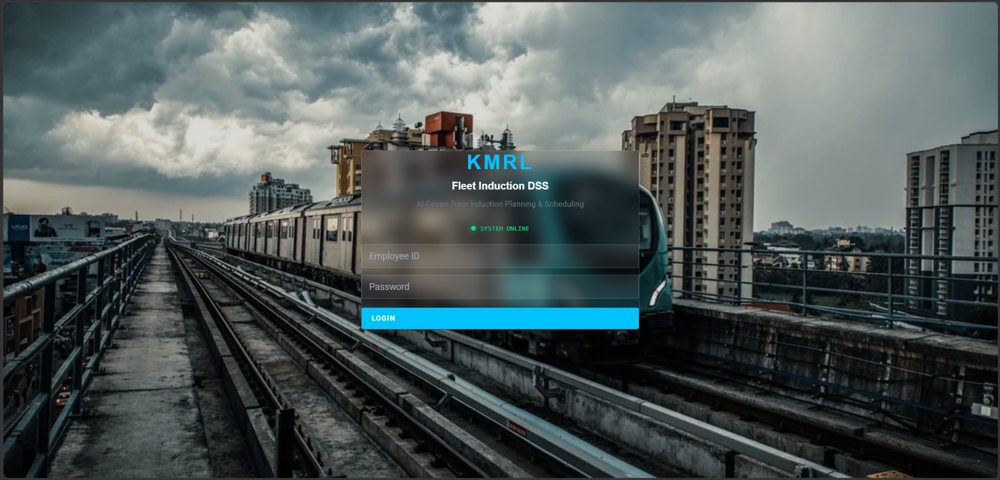
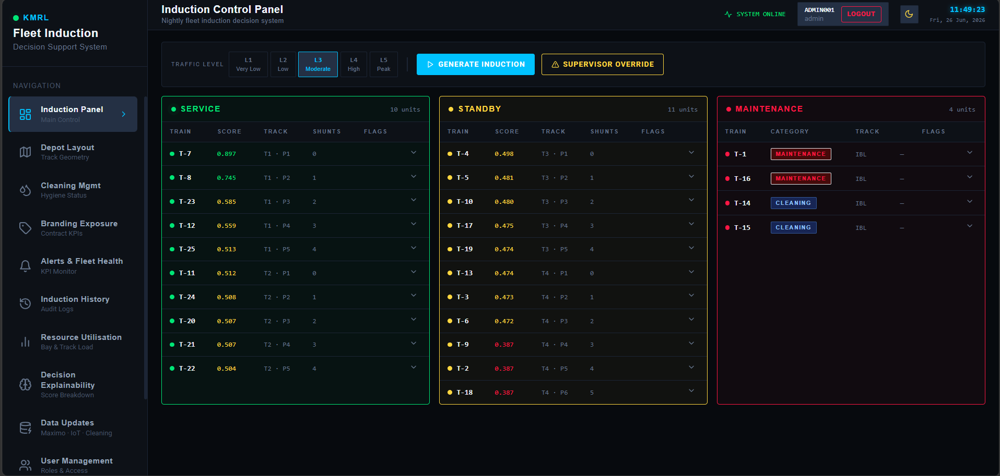
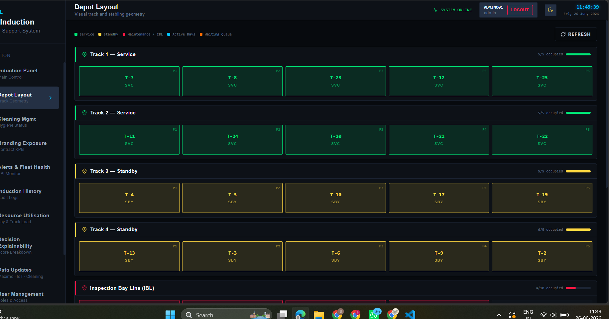
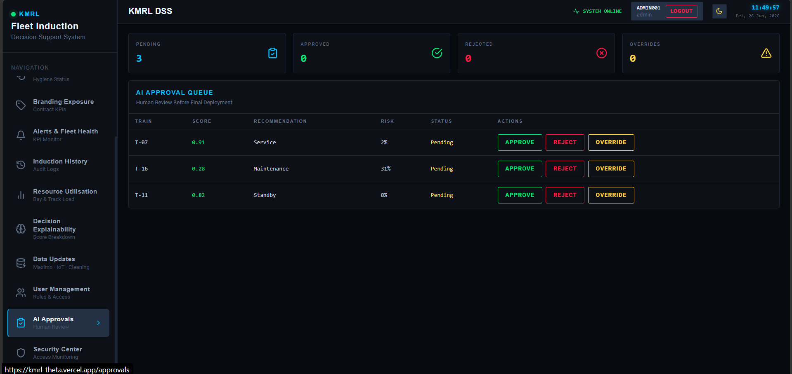
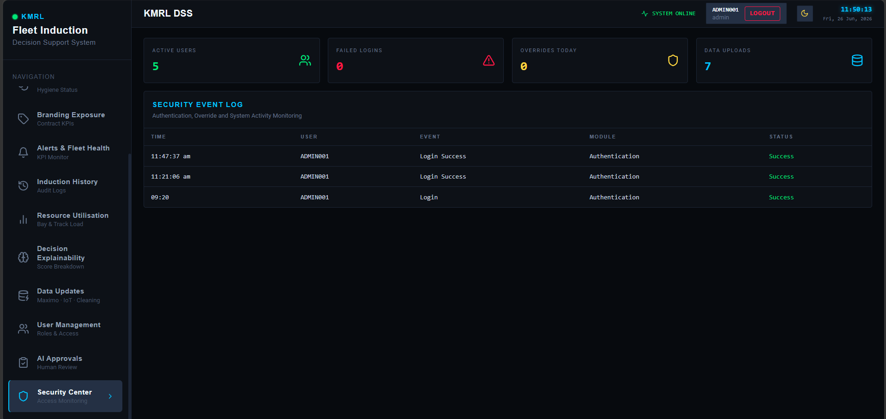

# 🚇 KMRL Fleet Induction Decision Support System (DSS)

> **Hybrid AI-Powered Decision Support System for Intelligent Metro Fleet Induction Planning**

An AI-powered Decision Support System for **Kochi Metro Rail Limited (KMRL)** that automates fleet induction planning using Machine Learning, predictive maintenance, operational business rules, IoT alerts, branding constraints, maintenance scheduling, and supervisor approvals.

---

# 🌐 Live Demo

## Frontend (Vercel)

https://kmrl-theta.vercel.app

## Backend API (Render)

https://kmrl-api.onrender.com

## Swagger Documentation

https://kmrl-api.onrender.com/docs

---

# 📖 Project Overview

The **KMRL Fleet Induction Decision Support System (DSS)** is a Hybrid AI-based web application developed to assist metro depot controllers in making accurate and efficient fleet induction decisions.

The system analyzes operational and maintenance data stored in the database and combines Machine Learning with operational business rules to recommend the most suitable trains for:

- ✅ Passenger Service
- 🟡 Standby
- 🔴 Maintenance

It also provides role-based authentication, AI approval workflows, security auditing, explainable AI, depot visualization, branding monitoring, predictive maintenance, and operational dashboards.

---

# ✨ Features

## 🚇 Fleet Management

- AI Fleet Induction Planning
- Depot Layout Visualization
- Resource Utilization Dashboard
- Daily Operational Reports

## 🤖 Artificial Intelligence

- Predictive Maintenance Risk Analysis
- AI Decision Explainability Dashboard
- AI Approval Workflow
- Supervisor Override Support
- Hybrid Rule-Based Decision Engine

## 📡 Smart Monitoring

- IoT Sensor Monitoring
- Cleaning Management
- Branding Exposure Tracking
- Maintenance Scheduling

## 🔐 Security

- Role-Based Authentication
- Secure Login System
- Security Center Dashboard
- Authentication Logs
- User Activity Monitoring
- Role-Based Navigation

## 📊 Analytics

- Fleet Health Dashboard
- Induction History
- KPI Monitoring
- AI Decision History
- Decision Breakdown

## 📂 Data Management

- CSV Upload
- Maximo Updates
- Supervisor Updates
- Cleaning Updates
- IoT Updates

---

# 🛠 Tech Stack

## Frontend

- React.js
- Vite
- JavaScript
- Tailwind CSS
- React Context API
- Lucide React Icons

## Backend

- FastAPI
- SQLAlchemy
- SQLite
- Pydantic
- REST API

## AI / Machine Learning

- Scikit-Learn
- NumPy
- Joblib
- Hybrid Rule-Based AI Engine

## Deployment

- Vercel
- Render

## Version Control

- Git
- GitHub

---

# 🏗️ System Architecture

```text
React Frontend
      │
 REST API
      ▼
FastAPI Backend
      │
 ┌────┼────┐
 │    │    │
 ▼    ▼    ▼
SQLite AI Engine Business Rules
      │
      ▼
Hybrid AI Decision Engine
      │
      ▼
Fleet Induction Recommendation
```

---

# 📂 Project Structure

```text
Kmrl
├── backend
├── frontend2
├── ml
├── screenshots
└── README.md
```

---

# 🚀 Running the Project Locally

## Clone Repository

```bash
git clone https://github.com/srihari18030606/Kmrl.git
cd Kmrl
```

## Backend

```bash
cd backend
pip install -r requirements.txt
uvicorn main:app --reload
```

Backend:
http://127.0.0.1:8000

Swagger:
http://127.0.0.1:8000/docs

## Frontend

```bash
cd frontend2
npm install
npm run dev
```

Frontend:
http://localhost:5173

---

# 🤖 AI Decision Logic

The Hybrid AI Decision Engine evaluates:

- Train Fitness
- Predictive Maintenance Risk
- Maintenance Job Cards
- Cleaning Status
- IoT Alerts
- Branding Exposure
- Supervisor Overrides
- Mileage
- Maintenance Expiry
- Depot Constraints
- Security Rules

The system recommends:

- Service
- Standby
- Maintenance

---

# 💾 Database

The application currently uses **SQLite** through SQLAlchemy ORM.

Stored data includes:

- Train Information
- Fleet Induction History
- AI Decision Snapshots
- Security Logs
- User Activity Logs

Demo deployments can be initialized using the **/seed-database** endpoint.

---

# 👥 User Roles

- Administrator
- Operations
- Maintenance
- Cleaning
- Commercial

Each role has dedicated dashboards and permissions.

---

# 📷 Application Screenshots

## Login Page



## Fleet Induction Dashboard



## Depot Layout



## AI Approval Dashboard



## Security Center



---

# 🔒 Security Features

- Role-Based Access Control
- Authentication Logging
- Security Event Monitoring
- AI Approval Logging
- Supervisor Action Logging
- Admin-only Security Dashboard

---

# 📈 Future Enhancements

- PostgreSQL Migration
- MQTT IoT Integration
- Live GPS Tracking
- Mobile Application
- WebSocket Real-Time Updates
- Multi Depot Support
- Email Notifications
- Cloud Authentication
- Digital Twin Visualization

---

# ⚠ Known Limitations

- Demo authentication uses predefined users.
- SQLite is used for demonstration deployment.
- IoT data is simulated.
- GPS integration is not implemented.

---

# 🌐 Deployment

Frontend: **Vercel**

Backend: **Render**

Database: **SQLite** (Future: PostgreSQL)

---

# 📜 License

Developed for educational and research purposes as a Final Year Engineering Project.

---

# 👨‍💻 Contributors

**Srihari S**

B.E. Computer Science and Engineering

**Siddhanth T.A**

B.E. Computer Science and Engineering

**Varsha S**

B.E. Computer Science and Engineering

---

# ⭐ Acknowledgements

- Kochi Metro Rail Limited (KMRL)
- FastAPI
- React
- SQLAlchemy
- Scikit-Learn
- Vercel
- Render
- GitHub

---

⭐ If you found this project useful, consider giving the repository a star.
